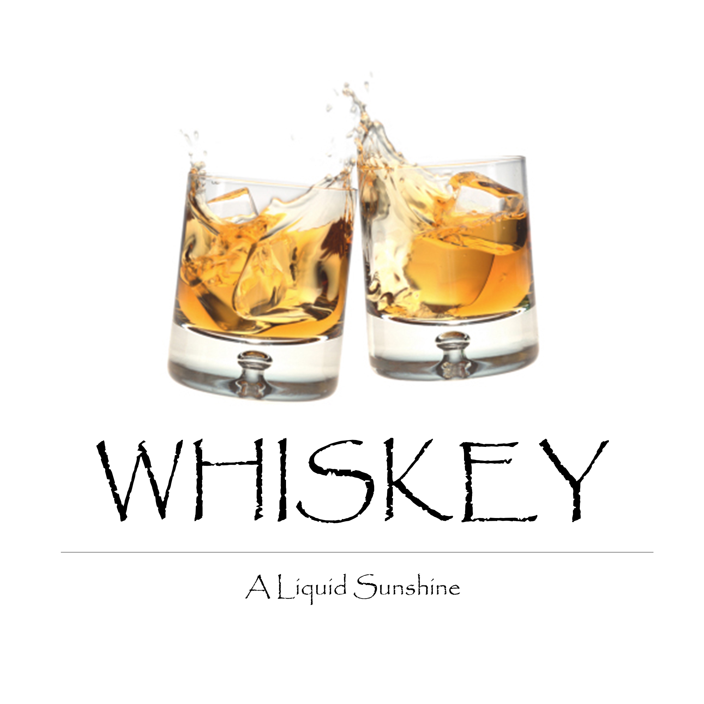

**Introduction:**

As George Bernard Shaw once said, ‘Whiskey is liquid sunshine’ – it has a unique taste, aroma, history and class. From the difference in ‘whiskey’ & ‘whisky’ and difference in ‘scotch’ & ‘bourbon’, there are lot of questions and lot more answers. This app will be our attempt to share this information while on the journey to try the best whiskey man has made to all the mixtures it has created, like Four Horsemen.

**Objective:**

While developing mobile application around whiskey, to visit concepts of mobile application development right from source control to user experience and share the knowledge with community.

**Features:**

To include: Facts and Quotes, Types, Brands, and Cocktails around whiskey

To use: Visual Studio 2015 along with Xamarin.Forms

To support: Android, iOS and Windows (UWP app)

